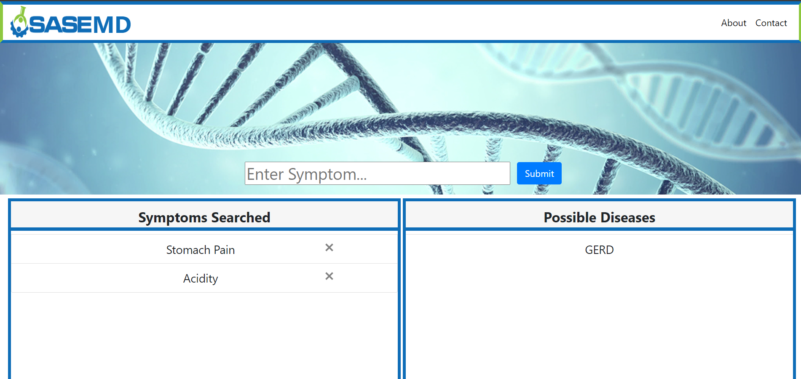
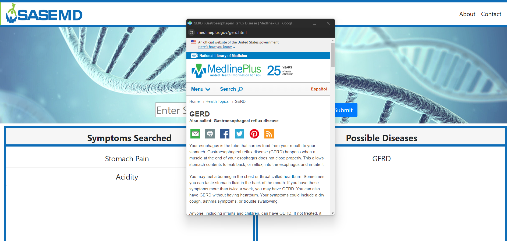

## Vision
The goal of this project is to create an accessible web application that can predict and possibly identify the disease that a patient might have based on the symptoms that the patient chronicles. 
Analogous to Google, as the user enters symptoms, the application draws possible diseases and illnesses with similar symptom profiles from a database. As the symptom list grows and gets more specific, 
the application gets more accurate. The dataset table will provide multiple diseases with symptoms already listed. Although the website can provide all these predictions of what the patient could have, 
it will not compare to an actual medical professional or primary doctor.

## Methodology
Frontend
* Structure of website with HTML and Javascript
* bootstrap for design templates
* CSS for stylistic presentation
* Javascript element selection used for event handling
  
Backend
* Flask web development framework
* CSV datasets from Kaggle
* python to clean data
* sqlite to create database

* deployed with live server for demonstration purposes

## Usage
The application is designed for user experience across various devices, ensuring mobile compatibility for ease of navigation. Upon accessing the main page through a browser, users are prompted to enter their symptoms. 
Upon submitting the symptoms, the application leverages its database to provide a list of potential diseases with similar symptoms. Clicking on a specific disease redirects users to an article sourced from the National Library of Medicine, offering detailed information. Users can then actively engage with the information by adding or removing symptoms as they please, with real-time updates to the list of potential diseases, allowing for a dynamic and personalized user experience.

## Documentation
Poster for presentation at the SASE (Society of Asian Scientists and Engineers) 2022 End-Of-Year Spring Banquet: https://docs.google.com/presentation/d/1Ka52l9U5s-D6gAxPIM1dK6x2p6_psuNJ/edit?usp=sharing&ouid=114474439847571787953&rtpof=true&sd=true

Report: https://docs.google.com/document/d/1ueMHcRmaRuk9Tu6wh07MYRSmbVS5kJ3Ltk-2yq2n7zU/edit?usp=sharing

## Acknowledgements
Development Team
* Richard Vo
* Yongjun Le
* Troy Tran
* Natalie Mar

Mentors
* Alexis Nguyen
* Danny Le

## Mentorship & Collaboration
Throughout this project, emphasis was placed on mentorship and collaborative learning. I (Danny Le) decided to take on the role of mentor, guiding each member on the development team through the fundamentals of coding in Python, JavaScript, CSS, and HTML, even with no prior experience. A pair programming system was implemented, ensuring that each member received personalized guidance and support, fostering an optimal learning environment. 

While I was hesitant at first to take on this project, I'm glad I did. This collaborative not only led to the successful completion of the project within a deadly, 2 week deadline, but also empowered my knowledge and skills as an educator. I am glad to have mentored Richard, Yongjun, and Troy with skills they can utilize to further their careers, and am proud of the entire team for being able to collaborate on a project that may change the future of medicine.     
